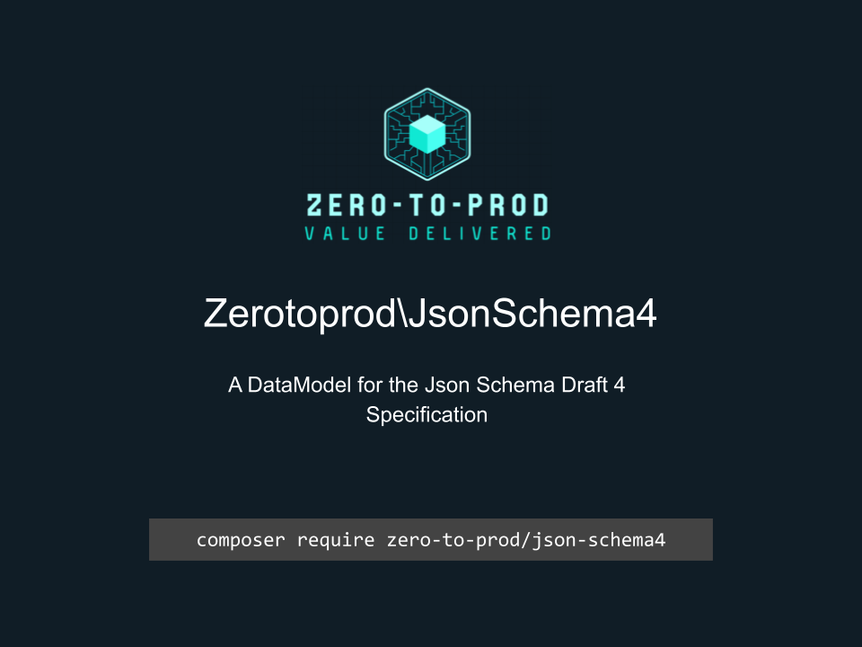

# Zerotoprod\JsonSchema4



[](https://github.com/zero-to-prod/json-schema4)
[](https://github.com/zero-to-prod/json-schema4/actions)
[](https://github.com/zero-to-prod/json-schema4/actions)
[](https://packagist.org/packages/zero-to-prod/json-schema4/stats)
[](https://packagist.org/packages/zero-to-prod/json-schema4)
[](https://github.com/zero-to-prod/json-schema4/blob/main/LICENSE.md)
[](https://wakatime.com/badge/github/zero-to-prod/json-schema4)
[](https://hitsofcode.com/github/zero-to-prod/json-schema4/view?branch=main)

## Contents

- [Introduction](#introduction)
- [Requirements](#requirements)
- [Installation](#installation)
- [Documentation Publishing](#documentation-publishing)
  - [Automatic Documentation Publishing](#automatic-documentation-publishing)
- [Usage](#usage)
- [Publishing DataModels](#publishing-datamodels)
- [Local Development](./LOCAL_DEVELOPMENT.md)
- [Contributing](#contributing)

## Introduction

A [DataModel](https://github.com/zero-to-prod/data-model) for the [Json Schema Draft 4](https://json-schema.org/draft-04/draft-zyp-json-schema-04) Specification.

## Requirements

- PHP 8.1 or higher.

## Installation

Install `Zerotoprod\JsonSchema4` via [Composer](https://getcomposer.org/):

```shell
composer require zero-to-prod/json-schema4
```

This will add the package to your project's dependencies and create an autoloader entry for it.

## Documentation Publishing

You can publish this README to your local documentation directory.

This can be useful for providing documentation for AI agents.

This can be done using the included script:

```bash
# Publish to default location (./docs/zero-to-prod/json-schema4)
vendor/bin/zero-to-prod-json-schema4

# Publish to custom directory
vendor/bin/zero-to-prod-json-schema4 /path/to/your/docs
```

### Automatic Documentation Publishing

You can automatically publish documentation by adding the following to your `composer.json`:

```json
{
    "scripts": {
        "post-install-cmd": [
            "zero-to-prod-json-schema4"
        ],
        "post-update-cmd": [
            "zero-to-prod-json-schema4"
        ]
    }
}
```

## Usage

```php
use Zerotoprod\JsonSchema4\JsonSchema4;

$JsonSchema4 = JsonSchema4::from(json_decode($json, true));

$JsonSchema4->schema;
```

## Publishing DataModels

You can directly import these files into your project like this:

```shell
./vendor/bin/json-schema4 app/JsonSchema4
```

The first argument is the destination of where the files are copied to.

## Contributing

Contributions, issues, and feature requests are welcome!
Feel free to check the [issues](https://github.com/zero-to-prod/json-schema4/issues) page if you want to contribute.

1. Fork the repository.
2. Create a new branch (`git checkout -b feature-branch`).
3. Commit changes (`git commit -m 'Add some feature'`).
4. Push to the branch (`git push origin feature-branch`).
5. Create a new Pull Request.
